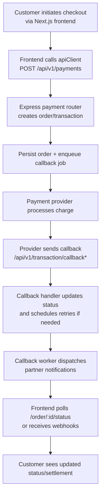
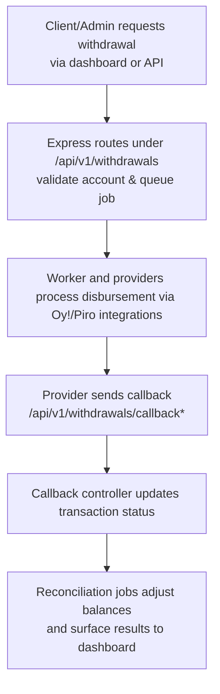

# Architecture Overview

## Platform Components

- **Frontend dashboard (Next.js)** – The `frontend/` package delivers the client, admin, and hosted checkout surfaces. Pages under `src/pages/client/*`, `src/pages/admin/*`, and the checkout entries consume the backend via an Axios client that is configured with `NEXT_PUBLIC_API_URL` and related environment variables. 【F:frontend/README.md†L1-L47】【F:frontend/src/lib/apiClient.ts†L1-L143】
- **Express API** – The backend defined in `src/app.ts` wires public authentication routes, payment APIs, admin tooling, partner client endpoints, and merchant dashboards under the `/api/v1` prefix. Callback handlers for payment gateways and withdrawal providers are registered before the authenticated routers so that external services can reach them without JWTs. 【F:src/app.ts†L67-L214】
- **Callback worker** – `src/worker/callbackQueue.ts` drains undelivered callback jobs from PostgreSQL, retries HTTP delivery with exponential control, and dead-letters the payload if retry budgets are exhausted or the receiver returns client errors. 【F:src/worker/callbackQueue.ts†L1-L100】
- **Background cron jobs** – Schedulers such as `scheduleSettlementChecker`, `scheduleDashboardSummary`, and `scheduleLoanSettlementCron` are imported in `src/app.ts` and can be activated to reconcile settlements and summarize dashboards on intervals. 【F:src/app.ts†L8-L12】【F:src/app.ts†L223-L228】
- **External integrations** – Providers like Oy!, Hilogate, GudangVoucher, Piro, and others are configured through environment-driven sections in `src/config.ts`. The same module also holds base URLs, callback targets, retry policies, AWS access, and authentication secrets for Auth0 and Telegram. 【F:src/config.ts†L15-L174】

## Payment Flow

- The payment router exposes `/api/v1/payments/create-order`, `/api/v1/payments/`, and status reads under `/api/v1/payments/order/:id/status` for API clients authenticated by API keys. 【F:src/route/payment.routes.ts†L72-L160】
- External payment gateways notify status changes through `/api/v1/transaction/callback`, `/api/v1/transaction/callback/gidi`, `/api/v1/transaction/callback/oy`, and related endpoints registered before other middleware. 【F:src/app.ts†L100-L152】
- Callback payloads are retried by the worker until the receiving partner confirms delivery. 【F:src/worker/callbackQueue.ts†L1-L93】

## Withdrawal Flow

- Authenticated client routes support account validation, submission, listing, and retries while enforcing bearer tokens with `requireClientAuth`. 【F:src/route/withdrawals.routes.ts†L54-L140】
- Server-to-server clients use the signed `/api/v1/withdrawals/s2s` endpoints that sit behind API key checks, IP whitelists, and signature verification. 【F:src/route/withdrawals.s2s.routes.ts†L1-L94】
- Provider callbacks for withdrawals are accepted at `/api/v1/withdrawals/callback`, `/api/v1/withdrawals/callback/piro`, and `/api/v1/withdrawals/callback/ing1`, where raw payloads are parsed for signature validation. 【F:src/app.ts†L112-L136】
- Settlement checkers and dashboard cron jobs consume the updated withdrawal states to reconcile balances. 【F:src/app.ts†L8-L12】

## External Dependencies & Configuration

- **PostgreSQL** – Prisma (`src/core/prisma.ts`) connects to the `DATABASE_URL` defined in `src/config.ts`, providing persistence for orders, callbacks, settlements, and user data. 【F:src/core/prisma.ts†L1-L23】【F:src/config.ts†L167-L174】
- **Apache Kafka** – Used for asynchronous event propagation across payments and withdrawals, as documented in the root README and `docs/events.md`. 【F:readme.md†L3-L60】【F:docs/events.md†L1-L109】
- **Third-party providers** – Oy!, Hilogate, GudangVoucher, Piro, Netzme, Genesis, Auth0, Telegram, AWS S3, and others consume environment variables declared in `src/config.ts`. Ensure `.env` (backend) and `.env.local` (frontend) mirror staging/production credentials. 【F:src/config.ts†L15-L174】【F:frontend/README.md†L17-L24】
- **Environment variables** – Backend configuration is centralized in `src/config.ts`, covering base URLs, callback targets, retry intervals, secrets, and provider credentials. Frontend runtime URLs are injected through `NEXT_PUBLIC_*` variables read by the Axios client. 【F:src/config.ts†L15-L174】【F:frontend/src/lib/apiClient.ts†L9-L37】

Refer back to this document when introducing new providers or touchpoints so that cross-cutting flows, callbacks, and dependencies remain aligned.
